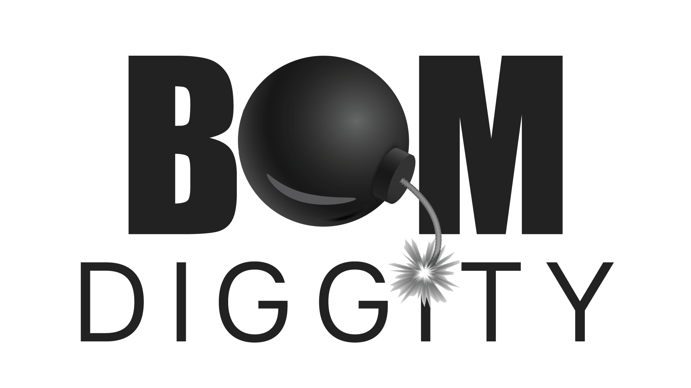

<p align="center">

</p>

<div align="center">

[]()
[](https://goreportcard.com/report/github.com/carbonetes/diggity)
[](https://github.com/carbonetes/diggity/releases/latest)
[](https://github.com/carbonetes/diggity)
[](https://github.com/carbonetes/diggity/blob/main/LICENSE)

BOM Diggity is an open-source tool developed to streamline the critical process of generating a comprehensive Software Bill of Materials (SBOM) for [Container Images](#getting-started) and [File Systems](#scanning-tarball-and-directory) across various [supported ecosystems](#supported-ecosystems). 

  
</div>

## Integration with Jacked
Diggity seamlessly integrates with our complementary open-source project, [Jacked](https://github.com/carbonetes/jacked). Jacked specializes in open-source vulnerability analysis, providing robust security insights for your software components. Diggity and Jacked offer a comprehensive solution for not only generating SBOMs but also assessing and mitigating security risks in your software supply chain.

## The Significance of a Software Bill of Materials (SBOM)
A Software Bill of Materials (SBOM) serves as a holistic inventory, cataloging every component, dependency, and third-party library that makes up a software application. This transparency-rich resource offers numerous benefits:

- **Security Assurance**: Identifying and addressing vulnerabilities within your software stack is made more accessible with a well-maintained SBOM.
- **Compliance Confidence**: Ensure compliance with licensing and legal requirements by having a clear understanding of your software's composition.
- **Enhanced Trust** Disclose your software's building blocks to users and stakeholders, fostering trust and transparency.
- **Operational Efficiency**: Streamline maintenance, updates, and collaboration within your development teams.

## Key Features
Diggity empowers developers, DevOps teams, and organizations with a range of features designed to make SBOM generation and management a seamless part of your software development process:
- **Automated Scanning**: Diggity automatically scans your project's source code and dependencies, intelligently piecing together an SBOM. This automation significantly reduces the manual effort required for creating and maintaining SBOMs.
- **Multiple SBOM Formats**: Flexibility is key. Diggity supports various industry-standard SBOM formats, including CycloneDX and SPDX, ensuring compatibility with your existing toolchain and compliance requirements.
- **Customization Options**: Tailor Diggity's SBOM generation process to the unique needs of your project. Customize component identification rules and output formats to match your project's specifics.
- **Seamless Integration**: Integrate Diggity into your CI/CD pipelines effortlessly. Continuously update SBOMs as your project evolves, ensuring that your SBOMs remain accurate and up-to-date.
- **Detailed Reporting**: Stay informed with detailed reports. Diggity provides insights into identified components, vulnerabilities, and licensing information, enabling proactive risk management and decision-making.

## Installation
### Using Curl (Linux/macOS)
Run the following command to download and install Diggity using Curl:
```bash
bash -c "$(curl -sSL curl -sSfL https://raw.githubusercontent.com/carbonetes/diggity/main/install.sh | sh -s -- -d /usr/local/bin)"
```
**Note**: Use root access with `sudo sh -s -- -d /usr/local/bin` if you encounter a Permission Denied issue, as the `/usr/local/bin` directory requires the necessary permissions to write to the target directory.
### Using Homebrew (Linux/macOS)
First, tap to the diggity repository by running the following command:
```bash
brew tap carbonetes/diggity
```
Then, install Diggity using Homebrew:
```bash
brew install diggity
```
To check if Diggity is installed properly, try running the following command:
```bash
diggity --version
```
### Using Scoop (Windows)
First, add the diggity-bucket by running:
```sh
scoop bucket add diggity https://github.com/carbonetes/diggity-bucket
```
Then, install Diggity using Scoop:
```sh
scoop install diggity
```
Verify that Diggity is installed correctly by running:
```sh
diggity --version
```

## Getting Started

**Note**: Diggity will automatically pull the image from the registry if it is not found in your local. But for large images, you need to do `docker pull` first before analyzing.

Diggity can now analyze your container image to identify its software components and generate an SBOM. Run the following command to perform the analysis:
```bash
diggity your-image:tag
```
- `your-image:tag`: Replace this with the name and tag of the container image you pulled.
<br />

Diggity will inspect the container image's file system and metadata to identify installed packages, libraries, and other dependencies.

## Scanning Tarball and Directory
Use the following command to analyze the contents of the Tar file:
```bash
diggity -t /path/to/your/file.tar
```
- `/path/to/your/file.tar`: Replace this with the actual path to your Tar file.
<br />
Diggity will inspect the contents of the Tar file and identify software components and dependencies.

And, to analyze the contents of the directory:
```bash
diggity -d /path/to/your/directory
```
- `/path/to/your/directory`: Replace this with the actual path to your directory.
<br />

Diggity will scan the directory's files and identify software components, libraries, and dependencies.
## Supported Ecosystems 
### Package Managers, Build Tools, and Plugins
These are the supported package managers, build tools, and plugins for generating Software Bill of Materials (SBOMs) using BOM Diggity. Use the corresponding command or configuration for each ecosystem to create SBOMs for your software projects.

| **Name**                        | **Description**                                           |
| ---------------------------------------------------- | --------------------------------------------------------- |
| **APK (Alpine Package Keeper)**                      | Package manager for Alpine Linux using `/apk/db/installed` |
| **DPKG (Debian Package Manager)**                    | Package manager for Debian-based distributions using `/dpkg/status`           |
| **RPM (Red Hat Package Manager)**                    | Package manager for Red Hat-based distributions using `Packages`, `Packages.db`, `rpmdb.sqlite` |
| **Pacman (Arch Linux Package Manager)**              | Package manager for Arch Linux using `/packman/local/*`       |
| **Conan (C/C++ Package Manager)**                    | Package manager for C and C++ projects using `conan.lock`, `conanfile.txt` |
| **Pub Package Manager (Dart)**                       | Package manager for Dart using `pubspec.yaml`, `pubspec.lock` |
| **NPM (Node Package Manager)**                       | Package manager for Node.js using `package.json`, `package-lock.json` |
| **Yarn (JavaScript Dependency Manager)**              | Dependency manager for JavaScript using `yarn.json`           |
| **NuGet (.NET Package Manager)**               | NuGet is the package manager for .NET, used to manage dependencies and libraries in .NET projects. It supports `.deps.json` files for dependency information, as well as project files like `.vbproj` and `.csproj` for Visual Basic and C# projects, respectively. |
| **Go Modules (Go)**                                 | Dependency management for Go using `go.mod`, `/gobin/*`   |
| **Cabal (Haskell Package Manager)**                  | Package manager for Haskell using `stack.yaml`, `stack.yaml.lock`, `cabal.project.freeze` |
| **Hex (Erlang Package Manager)**                     | Package manager for the Erlang ecosystem using `rebar.lock`, `mix.lock` |
| **Maven (Java Build Automation Tool)**                | Build automation tool for Java projects using `pom.xml`, `pom.properties`, `MANIFEST.MF` |
| **Gradle (Java, Groovy, Kotlin Build Tool)**         | Build tool for Java, Groovy, and Kotlin using `buildscript-gradle.lockfile`, `.build.gradle` |
| **Composer (PHP Dependency Manager)**                | Dependency manager for PHP using `composer.lock` |
| **Pip (Python Package Installer)**                   | Package installer for Python using `wheel`, `*.egg-info`, `requirements.txt`, `METADATA` |
| **Poetry (Python Packaging and Dependency Management)** | Python packaging and dependency management tool using `poetry.lock` |
| **RubyGems (Ruby Package Manager)**                  | Package manager for Ruby using `*.gemspec`, `Gemfile.lock` |
| **Cargo (Rust Package Manager)**                     | Package manager for Rust using `cargo.lock`               |
| **Cocoapods (Swift/Objective-C Dependency Manager)**  | Dependency manager for Swift and Objective-C using `Podfile.lock` |
| **Swift Package Manager (Swift)**                    | Package manager for Swift projects using `Package.resolved`, `.package.resolved` |
| **Nix (Package Manager and Build Tool)**             | Versatile package manager and build tool using `/nix/store/*` |
| **Jenkins Plugins (CI/CD)**                                 | Enhance Jenkins functionality with plugins for CI/CD automation and integrations with various tools and services. Supported file extensions: `*.jpi`, `*.hpi`. |
| **CRAN (Comprehensive R Archive Network)**            | Package manager for R, a language and environment for statistical computing and graphics, using `DESCRIPTION`, `NAMESPACE` files located in `/R/` directory. |

Diggity's support for these manifest files ensures accurate SBOM generation and comprehensive component analysis for a wide range of ecosystems and technologies.

### Languages
Diggity extends its support to various programming languages, allowing it to scan packages and components in projects written in these languages. Supported languages include:
- Java/Scala/Kotlin
- Python
- PHP
- Javascript
- Rust
- Swift
- Objective-C
- Ruby
- C/C++
- Go
- Dart
- C#/F#/Visual Basic
- Haskell
- Erlang
- R

## Available Commands and their flags with description:
Diggity offers a range of commands and flags to customize its behavior and cater to different use cases. Below, you'll find a summary of available commands along with their respective flags and brief descriptions:

These commands and flags provide fine-grained control over how you use Diggity, allowing you to configure settings, generate SBOM attestations, choose output formats, and tailor the tool to your specific requirements.

```bash
diggity config [flag]
```
|     Flag      |               Description                |
| :------------ | :--------------------------------------- |
| `-d, --display` | Displays the contents of the configuration file. |
| `-h, --help` | Help for configuration.       |
| `-p, --path` | Displays the path of the configuration file.          |
| `-r, --reset` | Restores default configuration file.   |

### Output formats

Diggity provides a variety of output formats to suit your preferences and integration needs. To generate a Software Bill of Materials (SBOM) in your preferred output format, use the following command structure:

```bash
diggity <target> -o <output-format>
```
**Choose the format that best suits your needs from the following options:**
- `table`: This is the default format, presenting a columnar summary of the software components and their details. It's easy to read and provides a quick overview.
- `json`: Choose JSON for a structured and machine-readable output. JSON is ideal if you want to integrate Diggity's SBOM data into other tools or systems.
- `cdx-xml`: Generate an SBOM in CycloneDX-compliant XML format. CycloneDX is a recognized industry standard for SBOMs, ensuring compatibility with a wide range of tools and platforms. [CycloneDX 1.5 XML Schema](https://github.com/CycloneDX/specification/blob/master/schema/bom-1.5.xsd)
- `cdx-json`: Similar to the XML format, CycloneDX JSON provides a machine-readable representation of the SBOM in JSON format, facilitating interoperability and automation. [CycloneDX 1.5 JSON Schema](https://github.com/CycloneDX/specification/blob/master/schema/bom-1.5.schema.json)
- `spdx-json`: Generate an SBOM in SPDX-compliant JSON format. SPDX is another industry-standard format for software component identification, licensing, and compliance. [SPDX 2.3 JSON Schema](https://github.com/spdx/spdx-spec/blob/development/v2.3.1/examples/SPDXJSONExample-v2.3.spdx.json)
- `spdx-tag`: This format presents the SBOM as a tag-value pair report conforming to the SPDX specification. It's a concise and human-readable format suitable for SPDX compliance reporting. [SPDX 2.3 Tag Schema](https://github.com/spdx/spdx-spec/blob/development/v2.3.1/examples/SPDXTagExample-v2.3.spdx)
- `spdx-yaml`: Similar to the tag-value format, SPDX YAML offers a more structured and easy-to-read representation of the SBOM in YAML format. [SPDX 2.3 YAML Schema](https://github.com/spdx/spdx-spec/blob/development/v2.3.1/examples/SPDXYAMLExample-2.3.spdx.yaml)
- `snapshot-json`: This format aligns with the dependency snapshot format of GitHub, making it compatible with GitHub's dependency tracking and security features. [Dependency Snapshot](https://docs.github.com/en/rest/dependency-graph/dependency-submission?apiVersion=2022-11-28)

With these output formats, Diggity provides flexibility to cater to your specific needs, whether it's for sharing, integration, compliance reporting, or further analysis of your software components.

## Configuration
Diggity provides a versatile configuration system that allows you to fine-tune the tool's behavior to suit your specific requirements. With the ability to customize settings, you can optimize Diggity to seamlessly integrate with your development workflow and meet your project's unique needs.

Key Configuration Options:
- **Secret Detection Customization**: Tailor the secret detection process by defining custom regex patterns for secrets, enabling you to effectively identify and protect sensitive information.
- **Parser and File Listing Control**: Fine-tune Diggity's package metadata parsing and file listing behavior to optimize performance and compatibility with your project's package manager and build tools.
- **Registry Authentication**: Configure authentication settings to pull container images from private registries, ensuring seamless access to the images you need for analysis.
- **Output Format Selection**: Choose the desired output format for your SBOMs, allowing you to integrate Diggity seamlessly with other tools and systems.
- **Attestation and Provenance**: Leverage Diggity's integration with Cosign for SBOM attestations and include provenance metadata to enhance the trustworthiness of your software components.

Customizing Diggity's configuration empowers you to maximize its capabilities and adapt it to the specific demands of your software projects, enhancing your overall development and security practices.

The Diggity configuration file is typically located at `<HOME>/.diggity.yaml`. You can access and modify this file to customize various aspects of Diggity's behavior to align with your project's requirements.

Configuration options (example values are the default):

```yaml
 # configuration file version
version: "1.0"
 # exclude files exceeding the specified size
max_file_size: 52428800
# configuration for accessing private container registries
registry:
    # username credential for private registry access
    username: ""
    # password credential for private registry access
    password: ""
 # attesting SBOMs using cosign key-pair and password
attestation:
    # path to generated cosign.key
    key: ""
    # path to generated cosign.pub
    pub: ""
    # password associated with the generated cosign key-pair
    password: ""
 # user defined settings for secret scanning
secret_config:
    # contains patterns and keywords to exclude specific files or data from secret detection scans. 
    whitelist:
        patterns:
        keywords: []
    # custom rules for detecting sensitive information in files.
    rules: []
```
## Private Registry Authentication
Diggity enables you to pull container images from private registries securely, ensuring seamless access to the images you need for analysis. Depending on your registry provider, you can configure authentication settings to authenticate with private registries. Below, we provide guidance for common private registry providers:
### Local Docker Credentials
When a container image runtime is not present in the local machine, Diggity can pull images from private registries using the provided credentials in your diggity config or as a flag. (--regisytryURI, --registryUsername, (--registryPassword or --registryToken))

An example `.diggity.yaml` looks something like this:
```yaml
registry:
  username: "docker_username"
  password: "docker_password"
```

### AWS ECR Credentials
To scan images from AWS Elastic Container Registry (ECR), you need to provide your account credentials in your Diggity configuration file.

First, obtain your authentication token by running the following command via AWS CLI:
```bash
aws ecr get-login-password
```
This command will output a password that is valid for 12 hours.

For more information, refer to the [AWS CLI documentation](https://docs.aws.amazon.com/cli/latest/reference/ecr/get-login-password.html).

Next, update your `.diggity.yaml` configuration file with the following details:
```yaml
registry:
  username: "AWS"
  password: "<password>"
```
Replace `<password>` with the password obtained from the AWS CLI command.

### Google Container Registry Credentials
To pull images from Google Container Registry, provide your account credentials in your Diggity configuration file. The username should be `oauth2accesstoken`. Obtain your authentication token by running the following command via the Google CLI tool:
```bash
gcloud auth print-access-token
```
Note that the authentication token is valid for about an hour only. For more information, check this [reference](https://cloud.google.com/container-registry/docs/advanced-authentication).

Your `.diggity.yaml` should look something like this:
```yaml
registry:
  username: "oauth2accesstoken"
  password: "<token>"
```
Replace `<token>` with the token obtained from the Google CLI command.

### JFrog Container Registry Credentials
To pull images from JFrog Container Registry, provide your account credentials in your Diggity configuration file. The username should be your JFrog username, and the password should be your JFrog API key or password.

First, obtain your JFrog API key by following the instructions in the [JFrog documentation](https://www.jfrog.com/confluence/display/JFROG/User+Profile#UserProfile-APIKey).

Next, update your `.diggity.yaml` configuration file with the following details:
```yaml
registry:
  username: "your-jfrog-username"
  password: "your-jfrog-api-key"
```

Replace `your-jfrog-username` with your actual JFrog username and `your-jfrog-api-key` with the API key you obtained.

For more information, refer to the [JFrog documentation](https://www.jfrog.com/confluence/display/JFROG/Getting+Started+with+Artifactory+as+a+Docker+Registry).

## Attestation
Diggity is integrated with [Cosign](https://docs.sigstore.dev/cosign/overview/), which allows you to sign and verify SBOM attestations on images you own. To run attestations, make sure to install Cosign on your machine. Then, generate your cosign key-pair associated with a password using the following command:

```
cosign generate-key-pair
```

This should generate the **cosign.key** and **cosign.pub** files. Specify their respective paths and password in your `.diggity.yaml` config file:

```yaml
attestation:
  key: path/to/cosign.key
  pub: path/to/cosign.pub
  password: "<password>"
```

Alternatively, you could specify the information using flags.

|     Flag      |               Description                |
| :------------ | :--------------------------------------- |
| `-k, --key` | Path to cosign.key used for the SBOM Attestation. |
| `-p, --pub` | Path to cosign.pub used for the SBOM Attestation.       |
| `--password` | Password for the generated cosign key-pair.          |

To run an attestation, make sure that your registry is logged into your machine. Run the following command:

```
diggity attest <image>
```

The attestation metadata can be saved to a file using:

```
diggity attest <image> -f <filename>
```

You can also pass in an already generated SBOM file using the **predicate** flag:

```
diggity attest <image> --predicate <path/to/bom_file>
```

## SLSA Provenance
Include provenance metadata to your SBOMs to provide an additional level of assurance about the secure process used
to build the software. To reference your provenance file, run the following command: 

```
diggity <image> -o json --provenance <path/to/provenance_file>
```

You can also include your provenance metadata in SBOM attestations using the following command:

```
 diggity attest <image> --provenance <path/to/provenance_file>
```

## Secret detection
Diggity includes a powerful secret detection feature that scans for sensitive information within your software components. This functionality is crucial for identifying and mitigating security risks associated with the presence of secrets, credentials, or sensitive data in your codebase.
- **User-Defined Patterns**: Customize secret detection by specifying regex patterns for secrets you want to identify, such as API keys, access tokens, or sensitive configuration information.
- **Efficient Scanning of File Systems**: Diggity efficiently scans container images for secrets, ensuring that your deployment artifacts remain free from potentially harmful information.

```json
    whitelist:
        patterns:
            - (.*?)(jpg|gif|doc|docx|zip|xls|pdf|bin|svg|socket|vsidx|v2|suo|wsuo|.dll|pdb|exe)$
        keywords: []
    rules:
        - id: AWS_ACCESS_KEY_ID
          description: Access Key is part of the security credentials used to authenticate and authorize activities with AWS (Amazon Web Services). These credentials are used to sign programmatic requests that you make to AWS, whether you're using the AWS Management Console, AWS CLI, or AWS SDKs.
          pattern: \b(?:A3T[A-Z0-9]|AKIA|AGPA|AIDA|AROA|AIPA|ANPA|ANVA|ASIA)[A-Z0-9]{16}\b
          keywords:
            - akia
            - agpa
            - aida
            - aroa
            - aipa
            - anpa
            - anva
            - asia
        - id: PRIVATE_KEY
          description: A private key, also known as a secret key, is a variable in cryptography that is used with an algorithm to encrypt and decrypt data. Secret keys should only be shared with the key's generator or parties authorized to decrypt the data.
          pattern: (?i)-----BEGIN[ A-Z0-9_-]{0,100}PRIVATE KEY( BLOCK)?-----[\s\S-]*KEY( BLOCK)?----
          keywords:
            - '-----BEGIN'
        - id: JWT_TOKEN
          description: JSON Web Token is a compact, URL-safe means of representing claims to be transferred between two parties.
          pattern: \b(ey[a-zA-Z0-9]{17,}\.ey[a-zA-Z0-9\/\\_-]{17,}\.(?:[a-zA-Z0-9\/\\_-]{10,}={0,2})?)(?:['|\"|\n|\r|\s|\x60|;]|$)
          keywords:
            - ey
```

## Contribute to the Project
We enthusiastically welcome contributions from the community! Whether you're interested in reporting issues, submitting pull requests, enhancing documentation, or just offering suggestions, your participation is invaluable. Find more details in our [Contribution Guidelines](https://github.com/carbonetes/diggity/blob/main/CONTRIBUTING.md).

## Get in Touch
Have questions, ideas, or need assistance? Don't hesitate to reach out to us at [eng@carbonetes.com](mailto:eng@carbonetes.com). We're here to support you.
<br />
Diggity is committed to simplifying SBOM generation, enhancing software security, and fostering transparency across the software development landscape. Join us in this mission!

## License

Diggity is released under the permissive [Apache 2.0 License](https://choosealicense.com/licenses/apache-2.0/), promoting a culture of openness and collaborative development. This license grants you the freedom to use, modify, and share Diggity in accordance with its terms.

<footer>
<h4>
  <p align="center">
    BOM Diggity is developed and maintained by <a href="https://carbonetes.com/">Carbonetes</a>. 
  </p>
</h4>
</footer>