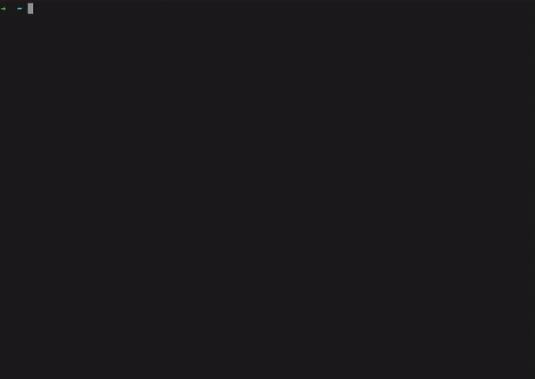

<p align="center">

</p>

BOM Diggity’s primary purpose is to ensure the security and integrity of software programs. It incorporates secret analysis allowing the user to secure crucial information before deploying any parts of the application to the public.

## Features
- 📁 | Generates SBOMs for container images, filesystems, archives, and more.
- 🔍 | Scans sensitive information and secrets
- 🔧 | Configuration that helps user's preference using the tool.
- ⛑ | Works with major operating system and many packages.
- 🗃 | Works seamlessly with [Jacked](https://github.com/carbonetes/jacked) (a vulnerability scanner)
- 🗄 | Converts between SBOM formats such as; CycloneDX, SPDX, and Diggity's own format.

### Supported Ecosystems

- Alpine (apk)
- Dart (pubs)
- Debian (dpkg)
- Dotnet (deps.json)
- Go (go.mod, Go binaries)
- Java (jar, ear, war, par, sar)
- JavaScript (npm, yarn)
- Jenkins Plugins (jpi, hpi)
- PHP (composer)
- Python (wheel, egg, poetry, requirements.txt)
- Red Hat (rpm)
- Ruby (gem)
- Rust (cargo.lock)

# Installation 📥

## Installation Support OS 💽
- Mac
  - darwin_amd64.tar.gz
  - darwin_arm64.tar.gz
- Linux
  - deb
    - linux_amd64.deb
    - linux_arm64.deb
    - linux_ppc64le.deb
  - rpm
    - linux_amd64.rpm
    - linux_arm64.rpm
    - linux_ppc64le.rpm
  - tar.gz
    - linux_amd64.tar.gz
    - linux_arm64.tar.gz
    - linux_ppc64le.tar.gz
- Windows
  - windows_amd64.zip
### Recommended
```bash
curl -sSfL https://raw.githubusercontent.com/carbonetes/diggity/main/install.sh | sh -s -- -d /usr/local/bin
```
you can specify a release version and destination directory for the installation:

```
curl -sSfL https://raw.githubusercontent.com/carbonetes/diggity/main/install.sh | sh -s -- -d <DESTINATION_DIR> -v <RELEASE_VERSION>
```
## Getting Started 🚀 

### SBOM
To generate an SBOM for a container image:
```
diggity <image>
```
<details>
<summary>Result</summary>



</details>

## Supported sources
Diggity can generate an SBOM from a variety of sources:

```
# catalog a container image archive (from the result of `docker image save ...`) using -t (or --tar) option:
diggity -t path/to/image.tar

# catalog a directory using -d (or --dir) option:
diggity -d path/to/dir

```

## Secret detection
  - User-defined patterns
  - Efficient scanning of container images

<details>
<summary>Result</summary>


</details>

## Useful Commands and Flags 🚩
```
diggity [command] [flag]
```
### Available Commands and their flags with description:

```
diggity config [flag]
```
|     Flag      |               Description                |
| :------------ | :--------------------------------------- |
| `-d, --display` | Displays the contents of the configuration file. |
| `-h, --help` | Help for configuration.       |
| `-p, --path` | Displays the path of the configuration file.          |
| `-r, --reset` | Restores default configuration file.   |

### Output formats

The output format for Diggity is also configurable using the
`-o` (or `--output`) option:

Available `formats` include:
- `table`: A columnar summary (default).
- `json`: Use this to get as much information out of Diggity.
- `cyclonedx-xml`: An XML report conforming to the [CycloneDX 1.4 specification](https://cyclonedx.org/specification/overview/).
- `cyclonedx-json`: A JSON report conforming to the [CycloneDX 1.4 specification](https://cyclonedx.org/specification/overview/).
- `spdx-tag-value`: A tag-value formatted report conforming to the [SPDX 2.2 specification](https://spdx.github.io/spdx-spec/).
- `spdx-json`: A JSON report conforming to the [SPDX 2.2 JSON Schema](https://github.com/spdx/spdx-spec/blob/v2.2/schemas/spdx-schema.json).format.


## Configuration

Configuration search paths:
- `<HOME>/.diggity.yaml`

Configuration options (example values are the default):

```yaml
secret-config:
  # enables/disables cataloging of secrets
  disabled: false
  #secret content regex are searched within files that match the provided regular expression
  secret-regex: API_KEY|SECRET_KEY|DOCKER_AUTH
  #excludes/includes secret searching for each specified filename
  excludes-filenames: []
  max-file-size: 10485760
# specify enabled parsers ([apk debian java npm composer python gem rpm dart nuget go]) (default all)
enabled-parsers: []
# disables file listing from package metadata
disable-file-listing: false
# disable all output except SBOM result
quiet: false
# save the sbom result to the output file instead of writing to standard output
output-file: ""
# supported output types: [json, table, cyclonedx, cyclonedx-json, spdx-json, spdx-tag-value] (default [table])
output: []
registry: 
  # registry uri endpoint
  uri: ""
  # username credential for private registry access
  username: ""
  # password credential for private registry access
  password: ""
  # access token for private registry access
  token: ""
```
## Private Registry Authentication
### Local Docker Credentials
When a container image runtime is not present in the local machine, Diggity can pull images from private registries using the provided credentials in your diggity config or as a flag. (--regisytryURI, --registryUsername, (--registryPassword or --registryToken))

An example `.diggity.yaml` looks something like this:
```yaml
registry:
  uri: "https://index.docker.io"
  username: "docker_username"
  password: "docker_password"
  token: ""
```

### AWS ECR Credentials
To pull images from AWS Elastic Container Registry (ECR), provide your account credentials in your diggity config. 
The URI follows the `<aws_account_id>.dkr.ecr.<region>.amazonaws.com` format, and the username would be  `AWS`. 
For the password, run the following command via AWS CLI to obtain your authentication token:

```
aws ecr get-login-password
```

Output:
```
<password>
```
Note that the authentication token is valid for 12 hours. 
For more information, check this [reference](https://docs.aws.amazon.com/cli/latest/reference/ecr/get-login-password.html).

Your `.diggity.yaml` should look something like this:
```yaml
registry:
  uri: "<aws_account_id>.dkr.ecr.<region>.amazonaws.com"
  username: "AWS"
  password: "<password>"
  token: ""
```


## License

[Apache 2.0](https://choosealicense.com/licenses/mit/)